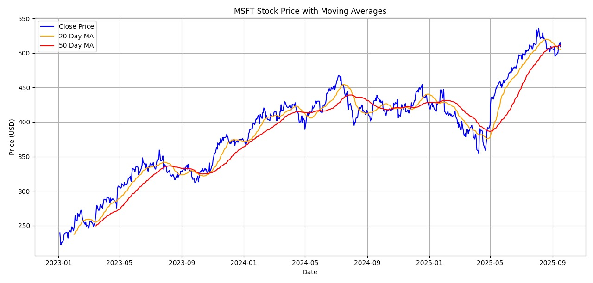

# Microsoft Stock Price Analysis

This project presents a simple financial analysis of Microsoft (MSFT) stock prices using moving averages.  
The goal is to demonstrate how 20-day and 50-day moving averages can be used to identify trends in stock price data.  
The project is beginner-friendly and implemented in Python using commonly used data science libraries.

## Project Overview

 Load historical MSFT stock data from a CSV file
 Calculate 20-day and 50-day simple moving averages
 Visualize closing prices along with moving averages using matplotlib

## Visualization

The plot below shows Microsoft’s stock closing prices with overlaid 20-day and 50-day moving averages:



## File Structure

 `msft_stock_analysis.py` : Main Python script containing data processing and visualization code  
 `msft-data-Sheet1.csv` : Historical stock data used for analysis  
 `moving_average_chart.png` : Output chart generated by the script  
 `README.md` : Project documentation

## Tools & Libraries

pandas 3.x  
pandas  
matplotlib

## How to Run

1. Clone the repository or download the files
2. Ensure required libraries are installed:
   ```bash
   pip install pandas matplotlib
   ```
3. Run the Python script:
   ```bash
   python msft_stock_analysis.py
   ```
4. The plot will be saved as `moving_average_chart.png` and also displayed in a window (if supported).

Notes

• Data was manually downloaded from Yahoo Finance due to rate-limiting issues with yfinance API  
• Can be extended to other stocks or include exponential moving averages for deeper insights

## License

This project is open-source and available for educational use.
